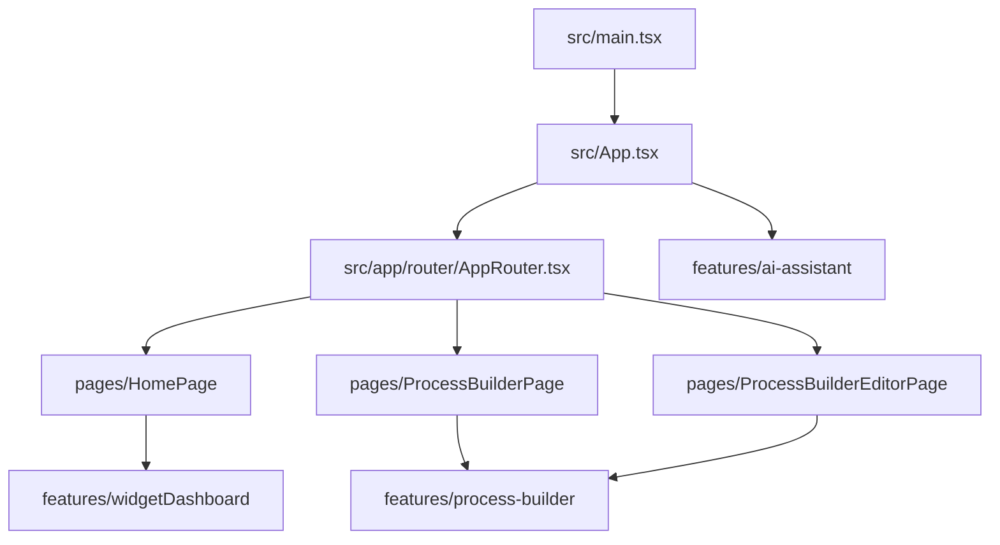
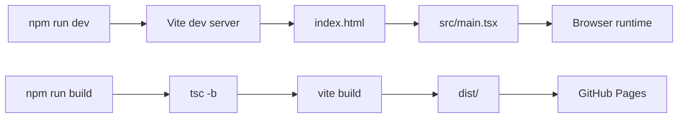

# Рабочий сайт: [https://zakbu.github.io/ECP3/](https://zakbu.github.io/ECP3/)

# ECP3 Frontend

ECP3 - фронтенд-приложение на React + TypeScript для внутренних рабочих сценариев.

В проекте есть:

- дашборд с виджетами на главной странице;
- конструктор бизнес-процессов;
- редактор процесса;
- плавающий AI-ассистент;
- отдельная витрина виджетов для дизайнера.

Production source of truth находится в `src/` и `index.html`.
Старые HTML-прототипы лежат в `docs/archive/prototypes/` и не используются как runtime-точки входа.

## Что нужно заранее

Для запуска нужен:

- Node.js версии 20 или новее;
- npm версии 10 или новее;
- Git, если вы хотите клонировать или отправлять проект в GitHub;
- браузер Chrome, Safari, Edge или Firefox.

Проверить, установлен ли Node.js:

```bash
node -v
```

Проверить npm:

```bash
npm -v
```

Если Node.js не установлен, скачайте LTS-версию с [nodejs.org](https://nodejs.org/).

Проверить Git:

```bash
git --version
```

## Как скачать проект с GitHub

Если репозиторий уже опубликован, откройте терминал и выполните:

```bash
git clone https://github.com/ZakBu/ECP3.git
cd ECP3
```

На Windows в PowerShell это выглядит так же:

```powershell
git clone https://github.com/ZakBu/ECP3.git
cd ECP3
```

Если вы скачали проект ZIP-архивом:

1. Распакуйте архив.
2. Откройте терминал.
3. Перейдите в папку проекта.

```bash
cd путь/до/папки/ECP3
```

На macOS можно написать `cd ` с пробелом, затем перетащить папку проекта в окно терминала и нажать Enter.

На Windows проще всего так:

1. Распакуйте ZIP-архив, например в `Downloads`.
2. Откройте папку проекта в Проводнике.
3. Кликните правой кнопкой мыши по пустому месту в папке.
4. Выберите `Открыть в терминале` или `Open in Terminal`.
5. Выполните команды запуска из следующего раздела.

Если нужно перейти в папку вручную через PowerShell:

```powershell
cd "$env:USERPROFILE\Downloads\ECP3"
```

Для старого Windows CMD:

```cmd
cd %USERPROFILE%\Downloads\ECP3
```

## Первый запуск

Установите зависимости:

```bash
npm install
```

Запустите локальный dev-сервер:

```bash
npm run dev
```

В терминале появится локальный адрес. Обычно это:

[http://localhost:5173/](http://localhost:5173/)

Важно: не закрывайте терминал, пока работаете с сайтом. Dev-сервер живёт в этом окне.

Полный пример для Windows PowerShell:

```powershell
cd "$env:USERPROFILE\Downloads\ECP3"
node -v
npm install
npm run dev
```

Полный пример для Windows CMD:

```cmd
cd %USERPROFILE%\Downloads\ECP3
node -v
npm install
npm run dev
```

## Как остановить сайт

В окне терминала, где запущен dev-сервер, нажмите:

```text
Ctrl + C
```

После этого локальный адрес перестанет открываться.

## Как запустить на другом порту

По умолчанию Vite запускается на первом свободном порту, чаще всего `5173`.

Если нужен конкретный порт:

```bash
npm run dev -- --port 3000
```

После запуска откройте:

[http://localhost:3000/](http://localhost:3000/)

## Проверка проекта

Перед публикацией или передачей проекта выполните:

```bash
npm run lint
npm run test
npm run build
```

Команды проверяют:

- `npm run lint` - стиль и базовые ошибки кода через ESLint;
- `npm run test` - unit/integration тесты через Vitest;
- `npm run build` - TypeScript и production-сборку Vite.

Успешная production-сборка появляется в папке `dist/`.

Локально посмотреть production build можно так:

```bash
npm run preview
```

Обычно preview откроется здесь:

[http://localhost:4173/ECP3/](http://localhost:4173/ECP3/)

## Основные страницы

Локально в dev-режиме:

- главная страница: [http://localhost:5173/](http://localhost:5173/);
- конструктор процессов: [http://localhost:5173/process-builder](http://localhost:5173/process-builder);
- витрина виджетов: [http://localhost:5173/widget-library.html](http://localhost:5173/widget-library.html).

На GitHub Pages:

- главная страница: [https://zakbu.github.io/ECP3/](https://zakbu.github.io/ECP3/);
- конструктор процессов: [https://zakbu.github.io/ECP3/process-builder](https://zakbu.github.io/ECP3/process-builder);
- витрина виджетов: [https://zakbu.github.io/ECP3/widget-library.html](https://zakbu.github.io/ECP3/widget-library.html).

## Widget Library для дизайнера

В проекте есть отдельный HTML entrypoint:

```text
widget-library.html
```

Это интерактивная витрина виджетов из текущего кода `src/features/widgetDashboard`.
В ней можно:

- переключать категории виджетов;
- переключать размер каждого виджета;
- просматривать поддерживаемые состояния виджетов.

Как открыть локально:

```bash
npm run dev
```

Затем перейти по ссылке:

[http://localhost:5173/widget-library.html](http://localhost:5173/widget-library.html)

Технически страница рендерится через `src/widget-library.tsx` и `src/widgetLibrary/WidgetLibraryPlayground.tsx`.

## Как опубликовать в GitHub

Если проект ещё не связан с GitHub-репозиторием:

```bash
git init
git add .
git commit -m "Initial ECP3 frontend"
git branch -M main
git remote add origin https://github.com/ZakBu/ECP3.git
git push -u origin main
```

Если репозиторий уже связан с GitHub и нужно отправить новые изменения:

```bash
git add .
git commit -m "Update ECP3 frontend"
git push
```

Проверить, куда будет отправлен проект:

```bash
git remote -v
```

## Как включается GitHub Pages

В проект добавлен workflow:

```text
.github/workflows/deploy.yml
```

После push в ветку `main` GitHub Actions:

1. устанавливает зависимости;
2. собирает проект командой `npm run build`;
3. публикует папку `dist/` в GitHub Pages.

Сайт будет доступен по адресу:

[https://zakbu.github.io/ECP3/](https://zakbu.github.io/ECP3/)

Если GitHub попросит выбрать источник Pages вручную:

1. Откройте репозиторий на GitHub.
2. Перейдите в `Settings`.
3. В левом меню откройте `Pages`.
4. В блоке `Build and deployment` выберите `GitHub Actions`.

## Как обновлять сайт

1. Измените файлы в `src/`, `public/`, `docs/` или корневые HTML entrypoints.
2. Проверьте локально:

```bash
npm run lint
npm run test
npm run build
```

3. Зафиксируйте изменения:

```bash
git add .
git commit -m "Update site"
git push
```

GitHub Pages обновится автоматически. Обычно это занимает от нескольких секунд до пары минут.

## Типовые проблемы

### `node: command not found`

Node.js не установлен или терминал не видит его в PATH. Установите LTS-версию с [nodejs.org](https://nodejs.org/) и откройте терминал заново.

### Порт `5173` занят

Запустите dev-сервер на другом порту:

```bash
npm run dev -- --port 3000
```

После запуска откройте `http://localhost:3000/`.

### `npm : File cannot be loaded because running scripts is disabled`

Такое иногда появляется в Windows PowerShell из-за политики выполнения скриптов.

Самый простой вариант: запустите проект через CMD:

```cmd
npm install
npm run dev
```

Или разрешите выполнение скриптов для текущего пользователя в PowerShell:

```powershell
Set-ExecutionPolicy -Scope CurrentUser RemoteSigned
```

После этого закройте PowerShell, откройте его заново и повторите запуск.

### GitHub Pages показывает 404

Проверьте, что:

- workflow `Deploy to GitHub Pages` завершился успешно;
- в `Settings -> Pages` выбран источник `GitHub Actions`;
- репозиторий называется `ECP3`;
- в `vite.config.ts` указан `base: "/ECP3/"`.

### После обновления GitHub Pages показывает старую версию

Сделайте hard refresh:

- macOS: `Cmd + Shift + R`;
- Windows/Linux: `Ctrl + F5`.

Если не помогло, подождите 1-2 минуты: GitHub Pages может обновляться не мгновенно.

## Структура проекта

```text
.
├── db/                  # SQL-миграции
├── docs/                # документация и архивы прототипов
├── public/              # статические файлы, копируются в dist
├── src/                 # основной React + TypeScript код
├── index.html           # основной HTML entrypoint
├── widget-library.html  # отдельная витрина виджетов
├── package.json         # команды запуска, сборки и проверки
├── vite.config.ts       # конфигурация Vite
└── README.md            # инструкция по запуску и публикации
```

Ключевые каталоги в `src/`:

- `src/app/router` - маршрутизация приложения;
- `src/pages` - page-level контейнеры;
- `src/features/widgetDashboard` - логика и UI виджетного дашборда;
- `src/features/process-builder` - конструктор процессов;
- `src/features/ai-assistant` - плавающий AI-ассистент;
- `src/theme` - тема и токены.

## Технический стек

- Core: React 19, TypeScript, Vite;
- UI: MUI, Emotion;
- Routing: `react-router-dom`;
- State management: `zustand`;
- Data/HTTP: `axios`;
- Graph/process editor: `@xyflow/react`, `dagre`;
- Charts/widgets: `recharts`;
- Quality: ESLint, Vitest.

## Схема модулей



## Схема запуска и сборки



## Архивные артефакты

Прототипные HTML-файлы хранятся в `docs/archive/prototypes/` и не должны использоваться для новой разработки.
Правила поддержки описаны в `docs/prototype-artifacts-policy.md`.
